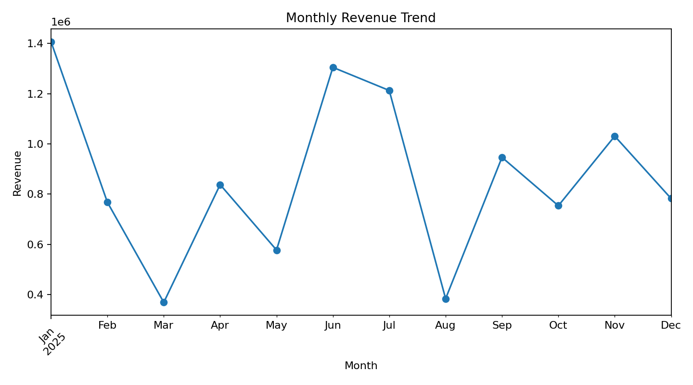
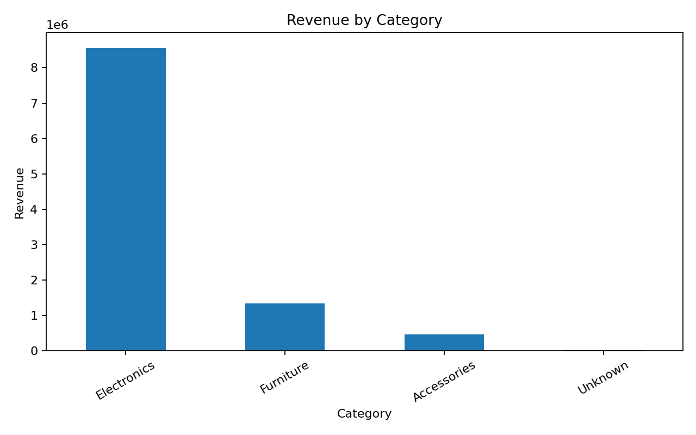
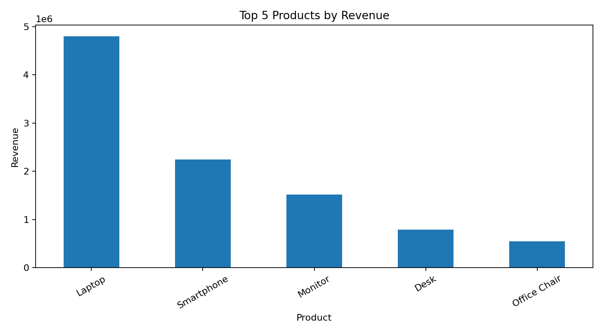

# Smart Data Analyser

A Python-based data analytics project that cleans, analyses, and visualizes sales data to generate useful business insights.

> **Project status:** Portfolio project built from scratch using a reproducible sample dataset.

## Features

- CSV data loading
- Data cleaning and missing-value handling
- Revenue and unit-sales analysis
- Product performance analysis
- Category performance analysis
- Monthly revenue trend analysis
- Automated result export to CSV
- Automated data visualizations

## Tech Stack

- Python
- Pandas
- NumPy
- Matplotlib

## Project Structure

```text
smart-data-analyser/
├── data/
│   └── sales_data.csv
├── src/
│   └── data_analyser.py
├── output/
│   └── analysis_results.csv
├── visualizations/
│   ├── monthly_sales.png
│   ├── category_sales.png
│   └── top_products.png
├── requirements.txt
├── .gitignore
└── README.md
```

## How to Run

1. Clone the repository.
2. Open a terminal in the project folder.
3. Install dependencies:

```bash
pip install -r requirements.txt
```

4. Run the analyser:

```bash
python src/data_analyser.py
```

The script reads `data/sales_data.csv`, cleans the data, performs the analysis, saves the summary to `output/analysis_results.csv`, and creates charts in `visualizations/`.

## Sample Insights

Using the included sample dataset:

- Total revenue: **₹10,374,730.00**
- Total units sold: **616**
- Average order revenue: **₹48,031.16**
- Top product by revenue: **Laptop**
- Top category by revenue: **Electronics**
- Number of orders: **216**

## Visualizations

### Monthly Revenue Trend



### Revenue by Category



### Top 5 Products



## Future Enhancements

- Interactive Streamlit dashboard
- Advanced statistical analysis
- Customer segmentation
- Sales forecasting
- Database integration
- Power BI/Tableau dashboard integration

## Disclaimer

This repository is a portfolio implementation created from scratch. The included dataset is synthetic and is intended for learning and demonstration purposes.
